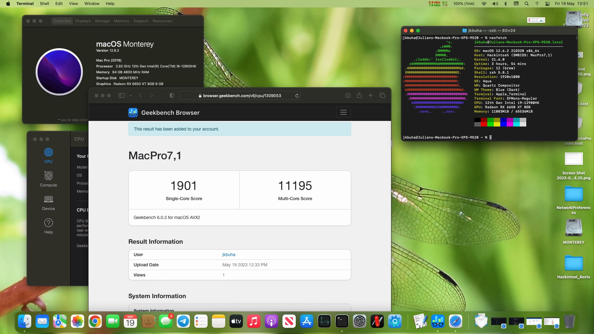

# Dell XPS 9520 macOS Monterey with OpenCore



# Details

| OpenCore Version | 0.8.5 |
| --- | --- |
| macOS Version | 12.6.1 (Monterey) |
| SMSBios | MacBookPro16,4 |

# Hardware Specifications

| Hardware | Specification | Status |
| --- | --- | --- |
| CPU | Intel Core i9-12900HK | ✅ Working |
| RAM | DDR5 64GB | ✅ Working |
| Audio | Realtek ALC3281 | ✅ Working |
| WiFi | Killer 1675 (AX211) | ✅ Working |
| Bluetooth | - | ✅ Working |
| SSD | Crucial P5 2TB | ✅ Working |
| Keyboard | - | ✅ Working |
| Trackpad | I2C Connection | ✅ Working |
| Webcam | - | ❌ Not Working |
| MicroSD Card | - |  ❌ Not Working |
| Fingerprint Sensor | Goodfix | ❌ Not Working |
| S3 | Sleep/Wake | ❌ Not Working |
| GPU | Intel Iris Xe Graphics | ❌ Not Working |
| eGPU | AMD Sapphire Radeon RX580 | ✅ Working |
| Display | 1920 x 1200 FHD LCD | ✅ Working |

# Overview

This is mostly a work in progress. With this latest configuration it is 
possible to install and run MacOS Monterey without graphics acceleration 
(yet!) but it will run smoothly with any eGPU (tested with an RX580).

# BIOS Settings

| Setting | Option |
| --- | --- |
| SATA Operation | AHCI |
| Fast Boot | Thorough |
| Secure Boot | Disabled |
| TMP 2.0 Security | Disabled |
| Intel SGX | Disabled |
| VT for Direct I/O | Disabled |
| Fingerprint Reader | Disabled |

# UEFI IFR edits
Ahead of installing, as with other hackintoshes you will need to disable 
CFG_LOCK using modGRUBshell as follows:

```bash
setup_var_cv CpuSetup 0x43 0x01 0x00
```

# Known Issues

- S3 Sleep not working
- Sleep/Wake not working

